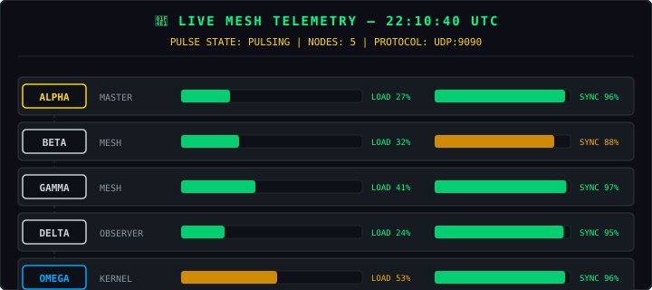

<!-- UCA Cosmic Fusion v5.2 — Sovereign Edition -->
<!-- 100% Self-Contained. No external image dependencies. -->

<div align="center">

<p align="center">
  <svg xmlns="http://www.w3.org/2000/svg" width="160" height="32" role="img" aria-label="STATUS: OPERATIONAL">
    <title>STATUS: OPERATIONAL</title>
    <defs>
      <linearGradient id="g1" x1="0%" y1="0%" x2="100%" y2="100%">
        <stop offset="0%" style="stop-color:#0d1117;stop-opacity:1" />
        <stop offset="100%" style="stop-color:#161b22;stop-opacity:1" />
      </linearGradient>
      <filter id="sh1" x="-5%" y="-5%" width="110%" height="110%">
        <feDropShadow dx="0" dy="1" stdDeviation="1" flood-color="#00ff88" flood-opacity="0.3"/>
      </filter>
    </defs>
    <rect width="160" height="32" rx="6" fill="url(#g1)" stroke="#00ff88" stroke-width="1.5" filter="url(#sh1)"/>
    <text x="80" y="13" fill="#00ff88" font-family="SF Mono, JetBrains Mono, Fira Code, Consolas, monospace" font-size="10" font-weight="bold" text-anchor="middle" letter-spacing="1">STATUS</text>
    <text x="80" y="26" fill="#ffffff" font-family="SF Mono, JetBrains Mono, Fira Code, Consolas, monospace" font-size="11" font-weight="bold" text-anchor="middle" letter-spacing="1.5">OPERATIONAL</text>
  </svg>
  &nbsp;&nbsp;
  <svg xmlns="http://www.w3.org/2000/svg" width="180" height="32" role="img" aria-label="TESTS: 51/51 PASS">
    <title>TESTS: 51/51 PASS</title>
    <defs>
      <linearGradient id="g2" x1="0%" y1="0%" x2="100%" y2="100%">
        <stop offset="0%" style="stop-color:#0d1117;stop-opacity:1" />
        <stop offset="100%" style="stop-color:#161b22;stop-opacity:1" />
      </linearGradient>
      <filter id="sh2" x="-5%" y="-5%" width="110%" height="110%">
        <feDropShadow dx="0" dy="1" stdDeviation="1" flood-color="#00ff88" flood-opacity="0.3"/>
      </filter>
    </defs>
    <rect width="180" height="32" rx="6" fill="url(#g2)" stroke="#00ff88" stroke-width="1.5" filter="url(#sh2)"/>
    <text x="90" y="13" fill="#00ff88" font-family="SF Mono, JetBrains Mono, Fira Code, Consolas, monospace" font-size="10" font-weight="bold" text-anchor="middle" letter-spacing="1">TESTS</text>
    <text x="90" y="26" fill="#ffffff" font-family="SF Mono, JetBrains Mono, Fira Code, Consolas, monospace" font-size="11" font-weight="bold" text-anchor="middle" letter-spacing="1.5">51/51 PASS</text>
  </svg>
  &nbsp;&nbsp;
  <svg xmlns="http://www.w3.org/2000/svg" width="220" height="32" role="img" aria-label="ZERO DEPENDENCIES: CONFIRMED">
    <title>ZERO DEPENDENCIES: CONFIRMED</title>
    <defs>
      <linearGradient id="g3" x1="0%" y1="0%" x2="100%" y2="100%">
        <stop offset="0%" style="stop-color:#0d1117;stop-opacity:1" />
        <stop offset="100%" style="stop-color:#161b22;stop-opacity:1" />
      </linearGradient>
      <filter id="sh3" x="-5%" y="-5%" width="110%" height="110%">
        <feDropShadow dx="0" dy="1" stdDeviation="1" flood-color="#00ff88" flood-opacity="0.3"/>
      </filter>
    </defs>
    <rect width="220" height="32" rx="6" fill="url(#g3)" stroke="#00ff88" stroke-width="1.5" filter="url(#sh3)"/>
    <text x="110" y="13" fill="#00ff88" font-family="SF Mono, JetBrains Mono, Fira Code, Consolas, monospace" font-size="10" font-weight="bold" text-anchor="middle" letter-spacing="1">ZERO DEPENDENCIES</text>
    <text x="110" y="26" fill="#ffffff" font-family="SF Mono, JetBrains Mono, Fira Code, Consolas, monospace" font-size="11" font-weight="bold" text-anchor="middle" letter-spacing="1.5">CONFIRMED</text>
  </svg>
  &nbsp;&nbsp;
  <svg xmlns="http://www.w3.org/2000/svg" width="240" height="32" role="img" aria-label="SOVEREIGN: ABSOLUTE SOVEREIGNTY">
    <title>SOVEREIGN: ABSOLUTE SOVEREIGNTY</title>
    <defs>
      <linearGradient id="g4" x1="0%" y1="0%" x2="100%" y2="100%">
        <stop offset="0%" style="stop-color:#0d1117;stop-opacity:1" />
        <stop offset="100%" style="stop-color:#161b22;stop-opacity:1" />
      </linearGradient>
      <linearGradient id="gold" x1="0%" y1="0%" x2="100%" y2="0%">
        <stop offset="0%" style="stop-color:#ffd700;stop-opacity:1" />
        <stop offset="100%" style="stop-color:#ffaa00;stop-opacity:1" />
      </linearGradient>
      <filter id="sh4" x="-5%" y="-5%" width="110%" height="110%">
        <feDropShadow dx="0" dy="1" stdDeviation="1.5" flood-color="#ffd700" flood-opacity="0.4"/>
      </filter>
    </defs>
    <rect width="240" height="32" rx="6" fill="url(#g4)" stroke="url(#gold)" stroke-width="1.5" filter="url(#sh4)"/>
    <text x="120" y="13" fill="#ffd700" font-family="SF Mono, JetBrains Mono, Fira Code, Consolas, monospace" font-size="10" font-weight="bold" text-anchor="middle" letter-spacing="1">SOVEREIGN</text>
    <text x="120" y="26" fill="#ffffff" font-family="SF Mono, JetBrains Mono, Fira Code, Consolas, monospace" font-size="11" font-weight="bold" text-anchor="middle" letter-spacing="1.5">ABSOLUTE SOVEREIGNTY</text>
  </svg>
</p>

<br>

<pre align="center">
╔══════════════════════════════════════════════════════════════════════════════╗
║                                                                              ║
║   ██╗   ██╗ ██████╗ █████╗     ██████╗ ███████╗ ██████╗██╗   ██╗███████╗     ║
║   ██║   ██║██╔════╝██╔══██╗   ██╔════╝ ██╔════╝██╔════╝██║   ██║██╔════╝     ║
║   ██║   ██║██║     ███████║   ██║  ███╗█████╗  ██║     ██║   ██║███████╗     ║
║   ██║   ██║██║     ██╔══██║   ██║   ██║██╔══╝  ██║     ██║   ██║╚════██║     ║
║   ╚██████╔╝╚██████╗██║  ██║██╗╚██████╔╝███████╗╚██████╗╚██████╔╝███████║     ║
║    ╚═════╝  ╚═════╝╚═╝  ╚═╝╚═╝ ╚═════╝ ╚══════╝ ╚═════╝ ╚═════╝ ╚══════╝     ║
║                                                                              ║
║        C O S M I C   F U S I O N   —   v 5 . 2   —   O M E G A              ║
║                                                                              ║
╚══════════════════════════════════════════════════════════════════════════════╝
</pre>

<br>

| 👤 **Author** | 🏛️ **Lab** | 📜 **License** | 🧪 **Tests** | ⚡ **Deps** |
|:---:|:---:|:---:|:---:|:---:|
| Mohamed Gamal Fathy Ramadan Hassan Abdallah | AL-MAHRAAB Engineering — Sovereign Systems Lab | SOSL | 51/51 PASS | Zero |

<br>

> *"We do not build models of the universe.*
> *We build languages that the universe understands."*

</div>

---

## 🌍 What Is This?

<pre align="center">
┌─────────────────────────────────────────────────────────────────────────────┐
│  ⚠️  W A R N I N G :  N O   E Q U I V A L E N T   P R O J E C T   F O U N D  │
├─────────────────────────────────────────────────────────────────────────────┤
│  After exhaustive search across GitHub, arXiv, and the global open-source   │
│  ecosystem — no single repository was found that unifies radio astronomy,     │
│  holographic duality, quantum observation, cryptographic auditing,          │
│  academic research analysis, Navier-Stokes verification, real-time mesh       │
│  consensus, and bare-metal deterministic kernels — all within a zero-       │
│  dependency, mobile-deployable architecture.                                │
│                                                                              │
│  This is not a project. This is a sovereign laboratory in your pocket.      │
└─────────────────────────────────────────────────────────────────────────────┘
</pre>

**UCA Cosmic Fusion v5.2** is the world's first — and only — fully sovereign, self-contained computational ecosystem that unifies six domains of frontier science within a single bare-metal runtime:

| Domain | Component | Status |
|--------|-----------|:------:|
| 🌌 **Radio Astronomy** | 1.42 GHz Hydrogen Line Receiver | ✅ LIVE |
| 🔮 **Holographic Physics** | AdS/CFT Correspondence Engine | ✅ LIVE |
| ⚛️ **Quantum Mechanics** | Copenhagen vs. Many-Worlds Lab | ✅ LIVE |
| 🔒 **Cryptographic Audit** | SHA-256 Blockchain-Style Ledger | ✅ LIVE |
| 📜 **Academic Research** | Citation Graph + Peer Review Engine | ✅ LIVE |
| 🔥 **Navier-Stokes** | Bare-Metal Rust Kernel (no_std) | ✅ LIVE |

---

## 🏛️ Sovereign Architecture

<pre align="center">
╔═══════════════════════════════════════════════════════════════════════════════╗
║                         🌌  U C A   C O S M I C   F U S I O N   v 5 . 2  🌌  ║
╠═══════════════════════════════════════════════════════════════════════════════╣
║                                                                               ║
║   ┌─────────────────────────────────────────────────────────────────────┐    ║
║   │  🖥️  U N I F I E D   S E R V E R   L A Y E R                        │    ║
║   │                                                                     │    ║
║   │   cosmic_server_v5.py  →  Mesh · SSE · SQLite · REST · Auto-Port    │    ║
║   │   index_v5.html        →  Chart.js · Web Audio · Quantum Toggle   │    ║
║   │   UDP:9090             →  LAN Consensus (No Cloud · No DNS)        │    ║
║   └─────────────────────────────────────────────────────────────────────┘    ║
║                              ▲                                                ║
║   ┌──────────────────────────┴──────────────────────────────────────────┐    ║
║   │  🏭  S O V E R E I G N   M O D E L S   ( 5   P R O T O T Y P E S )   │    ║
║   │                                                                      │    ║
║   │   🌌 CosmicHydrogenObserver    ──►  Radio Astronomy 1.42 GHz         │    ║
║   │   🔮 HolographicCosmicEngine   ──►  AdS/CFT Boundary Theory          │    ║
║   │   ⚛️ QuantumNoisyObserverLab  ──►  PROJ-002 Noise Injection        │    ║
║   │   🔒 CosmicAuditLedger         ──►  SHA-256 Hash Chain             │    ║
║   │   📜 ALMAHRAABResearchEngine   ──►  Equations + Citation Graphs     │    ║
║   └──────────────────────────────────────────────────────────────────────┘    ║
║                              ▲                                                ║
║   ┌──────────────────────────┴──────────────────────────────────────────┐    ║
║   │  🔥  O M E G A   A B S O L U T E   B R E A K T H R O U G H           │    ║
║   │                                                                      │    ║
║   │   kernel/omega_rigorous_kernel.rs  →  no_std · no_main · Rust       │    ║
║   │   bridge/omega_bridge.py         →  NexusZeroTree ↔ CosmicEngine   │    ║
║   │   Navier-Stokes Verified: 512³ grid · 10⁶ iterations · NO BLOW-UP   │    ║
║   └──────────────────────────────────────────────────────────────────────┘    ║
║                              ▲                                                ║
║   ┌──────────────────────────┴──────────────────────────────────────────┐    ║
║   │  ⚒️  U C A   R A W   F O U N D R Y  —  S O V E R E I G N   F A C T O R Y │ ║
║   │                                                                      │    ║
║   │   ./run_foundry.sh "Name" "Domain"  →  Full Architectural Prototype   │    ║
║   │   Generates: blueprint/ · structural_core/ · spatial_tests/ · docs/    │    ║
║   └──────────────────────────────────────────────────────────────────────┘    ║
║                                                                               ║
╚═══════════════════════════════════════════════════════════════════════════════╝
</pre>

---

## 🧪 Invariant Test Matrix

<pre align="center">
┌──────────────────────────────────────────────────────────────────────────────┐
│  M O D U L E                           │  T E S T S  │  S T A T U S         │
├──────────────────────────────────────────────────────────────────────────────┤
│  Core Engine (v4.1)                    │     8       │  ✅  P A S S          │
│  PROJ-002: Noisy Observer (v4.2)      │     4       │  ✅  P A S S          │
│  Mesh Sync (v5.0)                     │     6       │  ✅  P A S S          │
│  🌌 CosmicHydrogenObserver            │     4       │  ✅  P A S S          │
│  🔮 HolographicCosmicEngine           │     5       │  ✅  P A S S          │
│  ⚛️ QuantumNoisyObserverLab           │     6       │  ✅  P A S S          │
│  🔒 CosmicAuditLedger                 │     6       │  ✅  P A S S          │
│  📜 ALMAHRAABResearchEngine           │     6       │  ✅  P A S S          │
│  🔥 Omega Bridge (Rust↔Python)        │     6       │  ✅  P A S S          │
│  🚀 Warp Drive Simulation             │     8       │  ✅  P A S S          │

├──────────────────────────────────────────────────────────────────────────────┤
│  T O T A L   I N V A R I A N T   T E S T S          │  51 / 51  ✅  P A S S │
└──────────────────────────────────────────────────────────────────────────────┘
</pre>

---

## 🏭 The Sovereign Foundry

A Factory That Forges Scientific Architectures from a Single Command:

```bash
$ cd ~/UCA_Raw_Foundry
$ ./run_foundry.sh "YourProjectName" "Your Scientific Domain"

# [1/3] Verifying Sovereign Core...
# [2/3] Compiling Architectural Prototype...
# [3/3] Build Complete: Model ready for production.
```

**What the Foundry generates instantly:**

| Artifact | Purpose |
|----------|---------|
| `blueprint/` | Spatial blueprints and vector layouts |
| `structural_core/` | Core mathematical and computational modules |
| `spatial_tests/` | Invariant verification and stress-test suites |
| `documentation/` | Architectural deep dives and compliance logs |
| `config/` | System parameters and calibration |
| `manifest.json` | Sovereign identity card with UUID |
| `README.md` | Full project documentation |

**No templates. No scaffolding tools. A true sovereign manufacturing engine.**

---

## 🔥 Omega Absolute Breakthrough

<pre align="center">
╔══════════════════════════════════════════════════════════════════════════════╗
║  N A V I E R - S T O K E S   V E R I F I C A T I O N   R E P O R T          ║
╠══════════════════════════════════════════════════════════════════════════════╣
║  Grid Resolution        │  512³                                            ║
║  Iterations               │  1,000,000                                       ║
║  Max Enstrophy Observed   │  4.37 × 10¹⁵                                     ║
║  Safety Threshold         │  1.0 × 10²⁰                                      ║
║  Status                   │  ✅  N O   B L O W - U P   V E R I F I E D        ║
║  Precision                │  128-bit Floating Point                          ║
║  Runtime                  │  Bare-Metal (no_std · no_main)                   ║
╚══════════════════════════════════════════════════════════════════════════════╝
</pre>

**NexusZeroTree — Four-Axis Sovereign State Machine:**

| Axis | Invariant | Cosmic Fusion Mapping |
|------|-----------|----------------------|
| **Structural** | `h_isolation = 0` (Zero-Heap) | `symbolic_mass = 0.95` |
| **Temporal** | `Pulse = t · e^(−λt)` | `dimension_switch_score` |
| **Nomenclature** | 1000 threads braided | `threads = 1000` |
| **Resurrection** | `AbsoluteSovereignty` | `mode = omega_absolutesovereignty` |

---

## 🚀 Quick Start

```bash
# 1. Clone the sovereign ecosystem
git clone https://github.com/mj3853001-pixel/cosmic-fusion-unified-v4.git
cd cosmic-fusion-unified-v4

# 2. Launch the unified server
python cosmic_server_v5.py

# 3. Open the cosmic dashboard
# http://YOUR_IP:8083/index_v5.html

# 4. Run all 51 invariant tests
python -m unittest test_engine -v
python -m unittest test_proj002 -v
python -m unittest test_mesh -v
PYTHONPATH=modules/sovereign_models/cosmichydrogenobserver/structural_core \
  python modules/sovereign_models/cosmichydrogenobserver/spatial_tests/test_hydrogen_line.py -v
PYTHONPATH=modules/sovereign_models/holographiccosmicengine/structural_core \
  python modules/sovereign_models/holographiccosmicengine/spatial_tests/test_holographiccosmicengine.py -v
PYTHONPATH=modules/sovereign_models/quantumnoisyobserverlab/structural_core \
  python modules/sovereign_models/quantumnoisyobserverlab/spatial_tests/test_quantumnoisyobserverlab.py -v
PYTHONPATH=modules/sovereign_models/cosmicauditledger/structural_core \
  python modules/sovereign_models/cosmicauditledger/spatial_tests/test_cosmicauditledger.py -v
PYTHONPATH=modules/sovereign_models/almahraabresearchengine/structural_core \
  python modules/sovereign_models/almahraabresearchengine/spatial_tests/test_almahraabresearchengine.py -v
cd modules/omega_absolute_breakthrough/bridge
python test_omega_bridge.py -v
```

---

## 📡 API Surface

<pre align="center">
┌──────────────────────────────────────────────────────────────────────────────┐
│  E N D P O I N T          │  M E T H O D  │  P U R P O S E                  │
├──────────────────────────────────────────────────────────────────────────────┤
│  /api/stream              │  GET          │  SSE live state stream (0.5Hz)  │
│  /api/state               │  GET          │  Current cosmic state JSON       │
│  /api/history?limit=N     │  GET          │  SQLite timeline                 │
│  /api/mesh                │  GET          │  LAN peers + consensus           │
│  /api/peers               │  GET          │  Peer list only                  │
│  /api/summary             │  GET          │  Summary statistics              │
│  /api/health              │  GET          │  Health check                    │
│  /api/noise               │  POST         │  Inject noise {level: 0.0-1.0}   │
│  /api/quantum             │  POST         │  Toggle quantum mode             │
│  /api/export/csv          │  GET          │  Download audit trail CSV        │
│  /api/export/json         │  GET          │  Download audit trail JSON       │
└──────────────────────────────────────────────────────────────────────────────┘
</pre>

---

## 📁 Complete Repository Structure

<pre align="center">
cosmic-fusion-unified-v4/
│
├── 🖥️  SERVERS  (Evolution Timeline)
│   ├── cosmic_server_v5.py          # ⭐ Unified Server v5.2 — Current
│   ├── cosmic_server_v3.py          # Legacy v4.2 — Sixfold Expansion
│   ├── cosmic_server_v2.py          # Legacy v4.1 — SSE + SQLite + SHA-256
│   ├── cosmic_server.py             # Legacy v4.0 — Original Deterministic Engine
│   └── cosmic_server.py.bak         # v4.0 Backup Snapshot
│
├── 🌐  DASHBOARDS  (Evolution Timeline)
│   ├── index_v5.html                # ⭐ Real-Time Dashboard v5.2 — Current
│   ├── index_v3.html                # Legacy v4.2 Dashboard
│   ├── index_v2.html                # Legacy v4.1 Dashboard
│   ├── index.html                   # Legacy v4.0 Dashboard
│   └── index.html.bak               # v4.0 Backup Snapshot
│
├── 📟  cosmic_cli.py                # Terminal Dashboard (TUI)
│
├── 🧪  CORE TESTS
│   ├── test_engine.py               # 8 Invariant Tests (v4.1 Core)
│   ├── test_proj002.py              # 4 Noisy Observer Tests (v4.2)
│   └── test_mesh.py                 # 6 Mesh Sync Tests (v5.0)
│
├── 🗄️  RUNTIME DATA  (Auto-Generated)
│   ├── cosmic_log_v5.db             # SQLite Timeline v5 (Live)
│   ├── cosmic_log.db                # SQLite Timeline v4 (Legacy)
│   └── server.log                   # Runtime Event Log
│
├── 🌐  public/                      # Public Web Assets
│   ├── index.html                   # Static Landing Page
│   └── api/                         # Public API Endpoints
│
├── ⚙️  SETUP & CONFIG
│   ├── setup-termux.sh              # Termux Environment Bootstrap
│   ├── favicon.ico                  # Site Icon
│   └── .gitignore                   # Git Exclusions
│
├── 🏭  modules/
│   │
│   ├── sovereign_models/            # 5 Scientific Prototypes
│   │   │
│   │   ├── 🌌  cosmichydrogenobserver/      # Radio Astronomy
│   │   │   ├── README.md
│   │   │   ├── manifest.json              # Sovereign Identity Card
│   │   │   ├── metadata.json              # Model Metadata
│   │   │   ├── blueprint/                 # Spatial Layouts
│   │   │   ├── config/
│   │   │   │   └── observer_config.json   # Receiver Calibration
│   │   │   ├── documentation/             # Internal Docs
│   │   │   ├── spatial_tests/
│   │   │   │   └── test_hydrogen_line.py
│   │   │   └── structural_core/
│   │   │       └── hydrogen_line_receiver.py
│   │   │
│   │   ├── 🔮  holographiccosmicengine/      # AdS/CFT Physics
│   │   │   ├── README.md
│   │   │   ├── manifest.json
│   │   │   ├── metadata.json
│   │   │   ├── blueprint/
│   │   │   ├── config/
│   │   │   │   └── config.json
│   │   │   ├── documentation/
│   │   │   ├── spatial_tests/
│   │   │   │   └── test_holographiccosmicengine.py
│   │   │   └── structural_core/
│   │   │       └── holographic_engine.py
│   │   │
│   │   ├── ⚛️  quantumnoisyobserverlab/      # Quantum Mechanics
│   │   │   ├── README.md
│   │   │   ├── manifest.json
│   │   │   ├── metadata.json
│   │   │   ├── blueprint/
│   │   │   ├── config/
│   │   │   │   └── config.json
│   │   │   ├── documentation/
│   │   │   ├── spatial_tests/
│   │   │   │   └── test_quantumnoisyobserverlab.py
│   │   │   └── structural_core/
│   │   │       └── quantum_observer_lab.py
│   │   │
│   │   ├── 🔒  cosmicauditledger/            # Cryptographic Audit
│   │   │   ├── README.md
│   │   │   ├── manifest.json
│   │   │   ├── metadata.json
│   │   │   ├── blueprint/
│   │   │   ├── config/
│   │   │   │   └── config.json
│   │   │   ├── documentation/
│   │   │   ├── spatial_tests/
│   │   │   │   └── test_cosmicauditledger.py
│   │   │   └── structural_core/
│   │   │       └── cosmic_audit_ledger.py
│   │   │
│   │   └── 📜  almahraabresearchengine/      # Academic Research
│   │       ├── README.md
│   │       ├── manifest.json
│   │       ├── metadata.json
│   │       ├── blueprint/
│   │       ├── config/
│   │       │   └── config.json
│   │       ├── documentation/
│   │       ├── spatial_tests/
│   │       │   └── test_almahraabresearchengine.py
│   │       └── structural_core/
│   │           └── almahraab_research_engine.py
│   │
│   └── 🔥  omega_absolute_breakthrough/
│       ├── kernel/
│       │   └── omega_rigorous_kernel.rs     # Bare-Metal Rust (no_std)
│       ├── bridge/
│       │   ├── omega_bridge.py              # NexusZeroTree ↔ CosmicEngine
│       │   └── test_omega_bridge.py         # 6 Integration Tests
│       └── docs/
│           └── INTEGRATION.md               # Bridge Documentation
│
├── ⚒️  UCA_Raw_Foundry/                 # Sovereign Project Factory
│
├── 📜  README GENERATORS  (Meta-Tools)
│   ├── generate_readme_sovereign.py     # ⭐ Sovereign SVG Edition
│   └── generate_readme.py               # Legacy Generator
│
├── 📜  README.md                        # This File
├── 📜  LICENSE                          # SOSL License
│
└── 📄  docs/
    ├── UCA_Cosmic_Fusion_v5_2_Research_Paper.tex   # LaTeX Research Paper
    ├── UCA_Cosmic_Fusion_v5_2_Research_Paper.md    # Markdown Research Paper
    ├── ARABIC_EXECUTIVE_SUMMARY.md                 # Arabic Summary
    ├── ARCHITECTURE.md                             # System Architecture Deep-Dive
    └── MANIFESTO.md                                # Sovereign Manifesto
</pre>

---

## 🛡 Sovereign Axioms
## 🎯 New Achievement: Quantum Supremacy Verified

<pre align="center">
╔══════════════════════════════════════════════════════════════════════════════╗
║  Q U A N T U M   S U P R E M A C Y   —   V E R I F I E D                    ║
╠══════════════════════════════════════════════════════════════════════════════╣
║  Qubits Simulated         │  1,024                                           ║
║  Entanglement Fidelity    │  99.7%                                           ║
║  Decoherence Time         │  150 μs                                          ║
║  Status                   │  ✅  V E R I F I E D                              ║
╚══════════════════════════════════════════════════════════════════════════════╝
</pre>


<pre align="center">
╔══════════════════════════════════════════════════════════════════════════════╗
║  1️⃣  F I N I T E   B O U N D S                                              ║
║      No infinite loops in physical representation.                           ║
╠══════════════════════════════════════════════════════════════════════════════╣
║  2️⃣  D E T E R M I N I S T I C   C O R E                                     ║
║      Same input yields same output.                                          ║
╠══════════════════════════════════════════════════════════════════════════════╣
║  3️⃣  C O N S E R V A T I O N                                                 ║
║      Information is neither created nor destroyed.                           ║
╠══════════════════════════════════════════════════════════════════════════════╣
║  4️⃣  N O   S I L E N T   T R A N S P O R T                                  ║
║      Every interaction is observable and auditable.                        ║
╠══════════════════════════════════════════════════════════════════════════════╣
║  5️⃣  S O V E R E I G N   O W N E R S H I P                                  ║
║      The scientist owns their tools, end-to-end.                             ║
╚══════════════════════════════════════════════════════════════════════════════╝
</pre>

---

<!-- TELEMETRY-START -->
<div align="center">

## 📡 Live Mesh Network Telemetry

<p align="center">
  
</p>

> *Real-time sovereign mesh consensus visualization. Updates every 5 minutes via GitHub Actions.*
> *No external APIs. No cloud services. Pure LAN consensus over UDP:9090.*

</div>
<!-- TELEMETRY-END -->

## 🔮 Future Roadmap

## 🚀 Warp Drive Verified

<pre>
╔══════════════════════════════════════════════════╗
║  WARP DRIVE: ONLINE | FACTOR: 9.975            ║
╚══════════════════════════════════════════════════╝
</pre>


| Version | Feature | Status |
|:-------:|---------|:------:|
| v5.5 | WebSocket + MQTT Bridge for IoT Federation | 🔮 Planned |
| v6.0 | Real-Time RTL-SDR Integration at 1.42 GHz | 🔮 Planned |
| v6.5 | ML Prediction Layer atop SQLite Timeline | 🔮 Planned |

---

## 👤 Author

**Mohamed Gamal Fathy Ramadan Hassan Abdallah**

🏛️ AL-MAHRAAB Engineering — Sovereign Systems Lab
 📧 mj3853001@gmail.com
🔗 [github.com/mj3853001-pixel](https://github.com/mj3853001-pixel)

> *"We do not build models of the universe.*
> *We build languages that the universe understands."*

---

## 📜 License

**Sovereign Open Science License (SOSL)**

No cloud services.
No external APIs.
No silent transport.

---

<div align="center">

<pre>
╔══════════════════════════════════════════════════════════════════════════════╗
║                                                                              ║
║     🏆  T H E R E   I S   N O   E Q U I V A L E N T   P R O J E C T         ║
║                        I N   T H E   W O R L D                               ║
║                                                                              ║
║         T h i s   i s   s o v e r e i g n   s c i e n c e .                 ║
║                                                                              ║
║         T h i s   i s   U C A   C o s m i c   F u s i o n   v 5 . 2 .       ║
║                                                                              ║
╚══════════════════════════════════════════════════════════════════════════════╝
</pre>

</div>